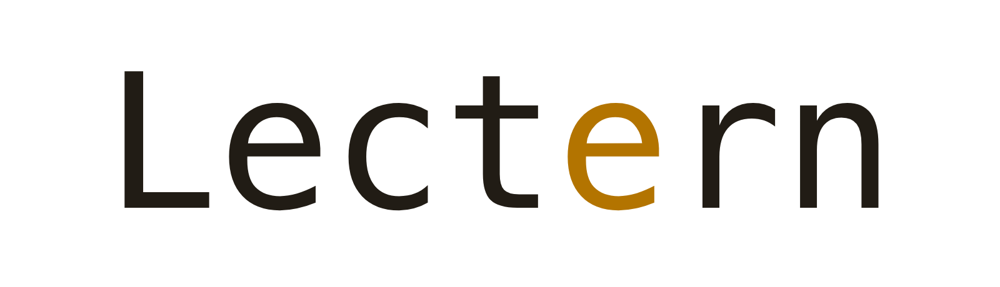
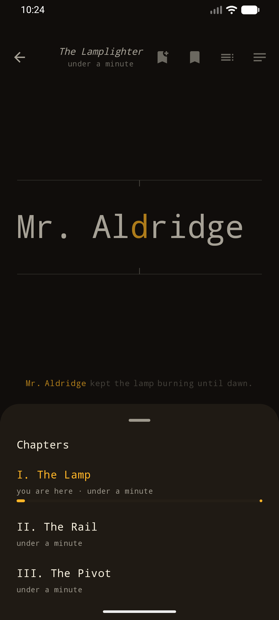
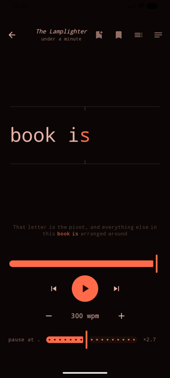

<p align="center">
  <picture>
    <source media="(prefers-color-scheme: dark)" srcset="docs/branding/wordmark-dark.png">
    
  </picture>
</p>

<p align="center">
  A speed reader for the web and Android: one word at a time, with the pivot letter fixed in one column, so your eyes stay still instead of scanning a line.
</p>

<p align="center">
  <a href="#quick-start">Quick Start</a> ·
  <a href="https://heerd.dev/lectern/">Web App</a> ·
  <a href="android/README.md">Android</a> ·
  <a href="IDEAS.md">Ideas</a>
</p>

<p align="center">
  <a href="https://heerd.dev/lectern/"></a>
  <a href="android/"></a>
  <a href="android/"></a>
</p>

<p align="center">
  <a href="https://apps.obtainium.imranr.dev/redirect?r=obtainium://app/%7B%22id%22%3A%22com.lectern%22%2C%22url%22%3A%22https%3A%2F%2Fgithub.com%2FSheepheerd%2Flectern%22%2C%22author%22%3A%22Sheepheerd%22%2C%22name%22%3A%22Lectern%22%2C%22preferredApkIndex%22%3A0%2C%22additionalSettings%22%3A%22%7B%5C%22includePrereleases%5C%22%3A%20false%2C%20%5C%22fallbackToOlderReleases%5C%22%3A%20true%2C%20%5C%22apkFilterRegEx%5C%22%3A%20%5C%22%5C%22%2C%20%5C%22versionDetection%5C%22%3A%20true%2C%20%5C%22about%5C%22%3A%20%5C%22A%20speed%20reader%3A%20one%20word%20at%20a%20time%2C%20with%20the%20pivot%20letter%20fixed%20in%20one%20column.%5C%22%7D%22%7D"></a>
</p>

<p align="center">
  
</p>

---

## Quick Start

Nothing to install for the web app. Open **[heerd.dev/lectern](https://heerd.dev/lectern/)**, drop in a PDF, EPUB or text file, and read.

To run it yourself:

```bash
git clone https://github.com/Sheepheerd/lectern.git
cd lectern
npm install
npm run dev
```

Open `http://localhost:5173`. `nix develop` provides Node if you use Nix.

The Android app builds with the Gradle wrapper. It needs JDK 17+ and an Android SDK:

```bash
scripts/android.sh
```

To install rather than build: grab the APK from the [latest release](https://github.com/Sheepheerd/lectern/releases/latest), or use the Obtainium badge above and let it track updates for you.

Build details, dependencies and the source layout are in the [Android readme](android/README.md).

## How It Works

Normal reading spends most of its time moving. Your eyes jump along the line, overshoot, and jump back. RSVP (rapid serial visual presentation) holds the text still and moves the words instead.

Lectern adds one thing to that. Each word is placed so its pivot letter, the optimal recognition point slightly left of centre, lands on the same column every time. A tick between two rails marks the column. You fixate once.

Speed on its own would cost comprehension, so the pacing is tuned. Sentence ends hold longer, commas and paragraph breaks pause, long and numeric words get more time, and abbreviations like "Mr." or "e.g." are detected so they do not trigger a false full stop.

## Features

- **Formats** — PDF, EPUB, TXT and Markdown on both apps; DOCX, FB2, HTML and article links on Android.
- **Pacing** — 60 to 1200 wpm, with separate pause dials for full stops, commas and paragraph breaks.
- **Chunking** — one, two or three words per flash. A chunk never crosses a full stop.
- **Warm-up** — starts at 75% speed and reaches the dial a few hundred words later.
- **Context line** — the sentence you are in, dimmed, under the word.
- **Navigation** — chapters from the EPUB table of contents, PDF bookmarks or Markdown headings; a paragraph view where any word is a jump target; bookmarks.
- **Shelf** — covers from EPUB or the PDF's first page, reading positions, tags, archiving, and backup to a zip.
- **Material You** — colours from your wallpaper on Android 12+, or four built-in palettes, in four typefaces including Atkinson Hyperlegible.
- **Control** — tap, swipe, tap zones, hold to peek, volume keys, and a hardware keyboard.

## Demo

The web app is live at **[heerd.dev/lectern](https://heerd.dev/lectern/)**, deployed from `main` by GitHub Pages. It keeps books and positions in `localStorage`, so nothing is sent anywhere and the shelf survives a reload.

| Key | Action |
|---|---|
| `Space` | play / pause |
| `↑` `↓` | faster / slower |
| `←` `→` | previous / next sentence |
| `C` | current paragraph; click a word to jump there |
| `T` | chapters |
| `Esc` | close a popup, or go back to the shelf |

## Android

<p align="center">
  
  
  
</p>

A native Kotlin app: Jetpack Compose, Material 3, Material You. It shares the design and the algorithms with the web app; the code is its own. Three screens on one back stack: shelf, reader, settings. Books also arrive by "open with", by share, or as a link to an article.

51 unit tests cover the parts that can be got wrong quietly: sentence-end detection, pivot placement, chunking, pacing, PDF re-flow, EPUB href resolution, DOCX and FB2 parsing, article extraction, and shelf ordering.

## Privacy

Everything is parsed on the device. PDFs, EPUBs and text never leave it, and there is no account, no telemetry and no server.

The one exception is the Android app's "read a link", which fetches the page you name. That is the only reason it holds the `INTERNET` permission.

## Ideas

[IDEAS.md](IDEAS.md) holds what is not built yet. The main one is a reading trainer: measure the speed at which your comprehension still holds, raise it a little at a time, and plot the curve.
