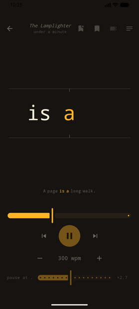
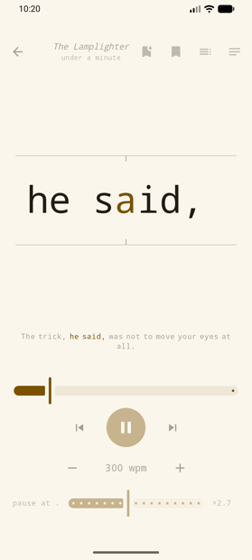
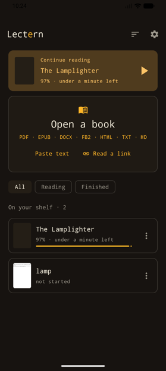
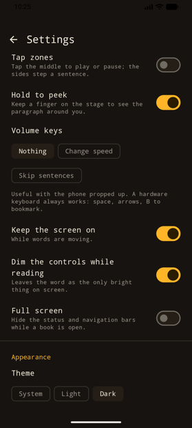

# Lectern for Android

The web app's speed reader, rebuilt as a native Kotlin app: Jetpack Compose,
Material 3, Material You. PDF, EPUB, DOCX, FB2, HTML and plain text are parsed
on the device.

<div align="center">




</div>

> The code in this repository is AI-generated. See the note in the
> [root README](../README.md).

## Layout

```
app/src/main/kotlin/com/lectern/
  MainActivity.kt       edge-to-edge host; open-with, share-to, shortcuts, keys
  Shortcuts.kt          launcher shortcuts for recent books
  core/Tokenize.kt      words to tokens, chapters, paragraphs, sentences, chunks
  core/ReaderEngine.kt  the clock: coroutine-paced, drift-corrected, warm-up
  core/Extract.kt       documents to sections; the Markdown heading parser
  core/PdfText.kt       PDFBox text, bookmarks, re-flow, first-page cover
  core/EpubText.kt      zip and jsoup: spine order, EPUB3 nav or EPUB2 NCX, cover
  core/OfficeText.kt    DOCX paragraphs and styles; FictionBook sections
  core/Article.kt       fetch a link, reduce the page to its article
  data/Library.kt       the shelf, bookmarks, covers, backup and restore
  data/Settings.kt      preferences, exposed as a StateFlow
  ui/LecternNavHost.kt  three destinations, one back stack
  ui/library/           shelf, continue reading, import, filters, book actions
  ui/reader/            the stage, transport, context line, chapters, bookmarks
  ui/settings/          pace, stopping, the stage, controls, appearance, backup
```

`core/` and `data/` are plain Kotlin with no Compose UI. The 51 unit tests cover
them: sentence-end detection, pivot placement, chunking rules, warm-up, pacing,
chapter and paragraph indexing, PDF re-flow, EPUB href resolution, DOCX and FB2
parsing, article extraction, shelf ordering.

## Reading

- **Tap the word** to start and stop. Tap zones split the stage instead: middle plays, sides step a sentence.
- **Swipe** sideways for sentences, up and down for speed. **Hold** to see the paragraph you are in.
- **Volume keys** change speed or skip sentences, for reading with the phone propped up. A hardware keyboard works too: space, arrows, `B` to bookmark.
- **Chunking** shows two or three words at once. A chunk never crosses a full stop.
- **Warm-up** starts at 75% speed and reaches the dial a few hundred words later.
- **Rewind on resume** steps back a word or two when you press play.
- **Break reminders** pause after a set stretch, and reading can stop at each chapter end.
- **The context line** shows the sentence you are in, dimmed, with the current words lit.
- **Pauses** are adjustable: full stops ×1 to ×5 of a word, plus extra at commas and paragraph breaks. Long and numeric words already take longer.
- **Speed can be per book**, since a novel and a spec want different paces.

Your place is saved as you read, so a book survives Android killing the app. The
back stack reopens it.

## The Shelf

Covers come from the EPUB itself or from the PDF's first page. Books can be
renamed, tagged, archived, restarted or removed, and the filter row narrows to
Reading, Finished, Archived or any tag. A continue-reading card resumes the last
book. The whole shelf, including texts, positions, bookmarks and covers, backs
up to a zip and restores on another device.

Books also arrive from other apps: open a file with Lectern, share text or a file
to it, or paste a link and let it keep the article.

## Colour and Type

On Android 12 and up the app takes its colours from your wallpaper, including the
pivot letter. A switch turns that off and shows four built-in palettes: Lamp
(warm near-black with an amber accent), Paper, Midnight (true black for OLED) and
Ember (dim red). The launcher icon has a monochrome layer for themed icons.

Type is the Material 3 scale in one of four faces: monospace (the default, which
keeps every word in the same column), sans, serif, or Atkinson Hyperlegible,
which is drawn for low vision and bundled under the SIL Open Font License.

Settings live in SharedPreferences rather than DataStore. The theme has to be
known on the first frame, and a synchronous read avoids painting the wrong one
and swapping it a moment later.

## Build

Needs JDK 17+ (Android Studio's bundled JBR works) and an Android SDK. The Gradle
wrapper handles the rest.

```sh
export JAVA_HOME="/Applications/Android Studio.app/Contents/jbr/Contents/Home"
./gradlew :app:assembleDebug        # app/build/outputs/apk/debug/app-debug.apk
./gradlew :app:testDebugUnitTest    # core logic tests
./gradlew installDebug              # onto a running device or emulator
```

`local.properties` points at the SDK (`sdk.dir=...`) and is not checked in.

- minSdk 26, targetSdk 36, compileSdk 37
- AGP 9.4 / Gradle 9.7.1 / Kotlin 2.4. AGP 9 has built-in Kotlin support, so there is no `kotlin-android` plugin in the build files.
- Navigation Compose with type-safe routes. The reader is addressed by book id, which is what makes state restoration work for free.
- The only permission is `INTERNET`, used when you ask it to read a link.
